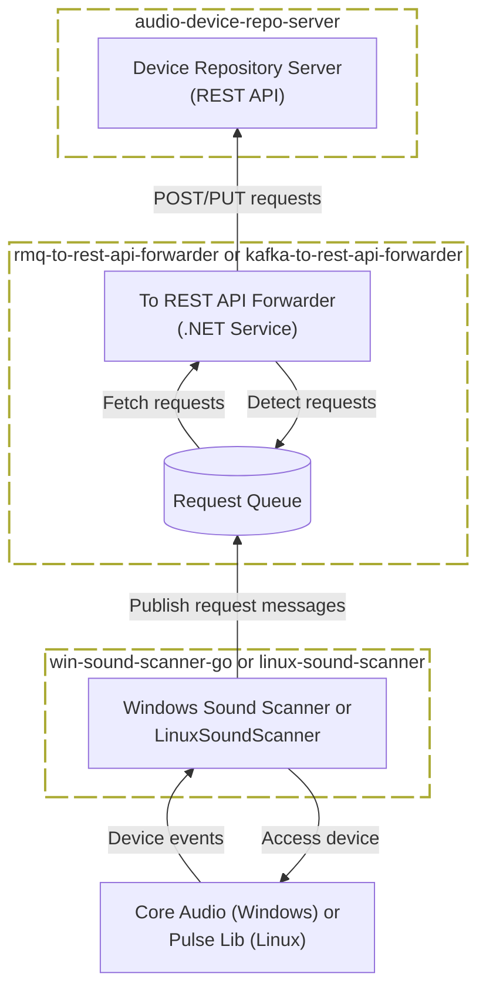

# Collect Sound Devices

A distributed, event-driven system that discovers and monitors sound devices on
end-point PCs (Windows and Linux) and keeps them in a [central registry](https://list-audio-react-app.vercel.app).

## Architecture Overview

## Key Components

| Repository | Tech | Description |
|-----------|------|-------------|
| [audio-device-repo-server](https://github.com/collect-sound-devices/audio-device-repo-server/) | C# | REST API server, the central device registry |
| [list-audio-react-app](https://github.com/collect-sound-devices/list-audio-react-app/) | React / Next.js / TypeScript | Web UI, [live on Vercel](https://list-audio-react-app.vercel.app) |
| [win-sound-scanner-go](https://github.com/collect-sound-devices/win-sound-scanner-go) | Go / C++ | Windows service detecting device changes and publishing them to RabbitMQ |
| [linux-sound-scanner](https://github.com/collect-sound-devices/linux-sound-scanner) | C++ | Linux equivalent of the Windows sound scanner |
| [rmq-to-rest-api-forwarder](https://github.com/collect-sound-devices/rmq-to-rest-api-forwarder) | C# | Forwards RabbitMQ messages to the REST API (distributed via Docker) |
| [kafka-to-rest-api-forwarder](https://github.com/collect-sound-devices/kafka-to-rest-api-forwarder) | C# | Same as above, using Kafka instead of RabbitMQ |

## License

[MIT](../LICENSE)

## Contact
Eduard Danziger 
[github.com/eduarddanziger](https://github.com/eduarddanziger) 
[eduard.danziger@gmx.de](mailto:eduard.danziger@gmx.de)
